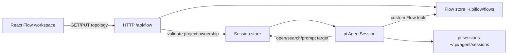
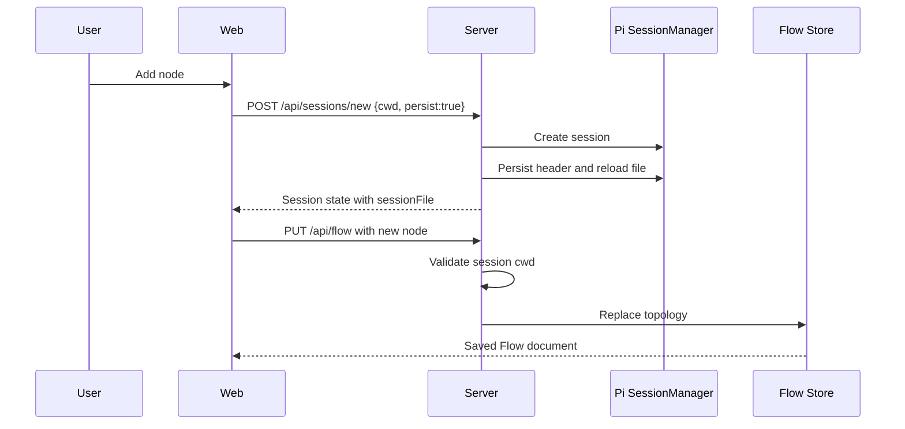
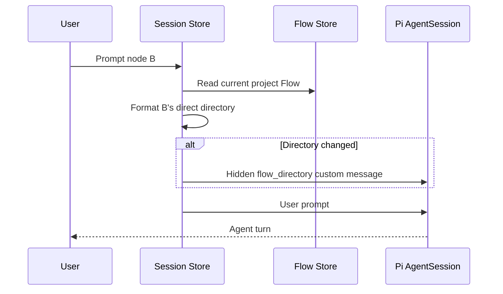
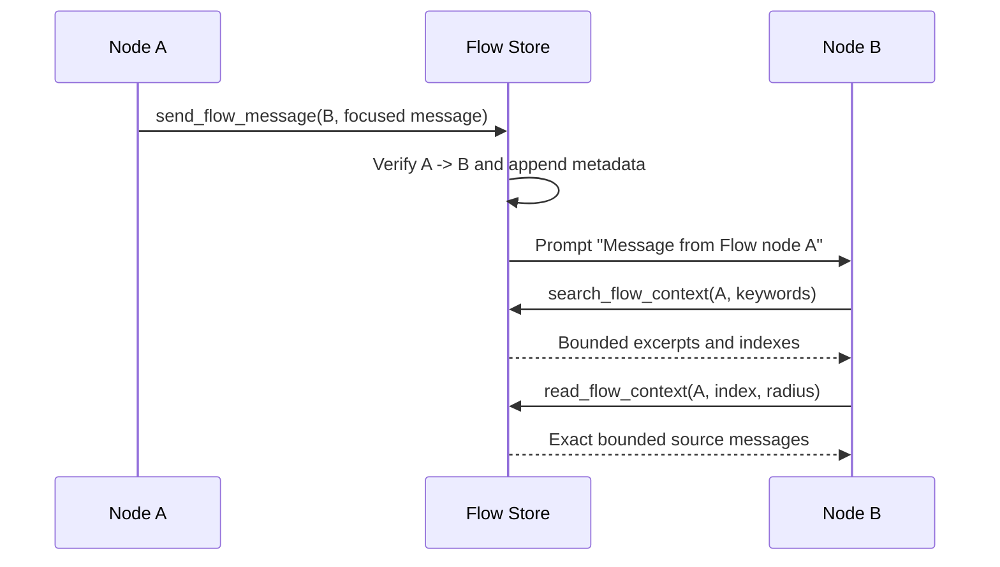

# Flow Technical Design

**Status:** Implemented MVP with active follow-up work
**Last updated:** 2026-08-09
**Scope:** Project-scoped multi-session collaboration in piflow

## 1. Purpose

Flow is piflow's project workspace for coordinating multiple independent pi sessions without forcing the developer to switch projects, applications, or mental contexts.

The product name primarily refers to the developer's flow state. The canvas is useful because it keeps related sessions, their current goals, and their communication boundaries visible in one project. It is not the product's primary meaning, and it must not weaken the focused Agent GUI.

The core product objective is:

> Keep the information and decisions required for the current project available without interrupting the developer's train of thought.

This means the user may still watch the Agent think and code. The problem is not attention itself; the problem is having to leave the current project, reconstruct another project's state, retrieve data elsewhere, and then return.

## 2. Relationship To Existing Product Documents

This document describes the current Flow domain model and implementation. Where it conflicts with the older canvas proposal in [`docs/PRD.md`](./PRD.md), this document and the shipped implementation are authoritative.

In particular, the current MVP does **not** use:

- Vue
- Session, Context, Artifact, and Decision node types
- parent/child or `derived from` edges
- automatic Agent execution when an edge is created
- browser-local Flow persistence

The focused chat experience remains the primary workflow. Flow is a dedicated, optional project view.

## 3. Product Model

### 3.1 One Node Is One Independent Pi Session

A Flow node represents one persisted pi session with its own context window and message history.

A node is not:

- one prompt
- one fixed Agent role
- one step in a mandatory pipeline
- one child branch of another node
- one isolated worktree

Nodes may represent whatever decomposition helps the user think clearly, for example:

- different modules in the same feature
- implementation and review sessions
- investigation and execution sessions
- frontend and backend work
- separate issues in the same repository
- sequential stages whose contexts should remain independent

The node's `name` and `goal` are user-facing context descriptors. They also serve as a lightweight index that helps connected Agents decide whether another session may contain relevant information.

### 3.2 Nodes Are Peers

All Agent session nodes are peers. There is no parent/child hierarchy.

Creating B while looking at A does not make B a branch of A. B starts with a clean context. A and B only gain knowledge of one another through user-created directed edges.

This is deliberate. The purpose of splitting work into sessions is to reduce context corruption and context rot, not to silently copy an increasingly large conversation into every new Agent.

### 3.3 Edges Are Directed Capability Boundaries

For an edge `A -> B`:

- A may discover B as an outgoing node.
- A may send an explicit message to B.
- B may discover A as an incoming node.
- B may search and read bounded excerpts from A's session.
- B cannot send to A unless the user also creates `B -> A`.
- A cannot search B unless the user also creates `B -> A`.

No edge means complete Flow-level isolation. The sessions do not discover each other and cannot use Flow tools to communicate or inspect one another.

Deleting an edge revokes future discovery, sending, search, and read permissions. It does not rewrite messages or information already delivered into a session.

### 3.4 The User Owns The Topology

Only the user creates and removes edges. Agents cannot create connections themselves.

This prevents an Agent from expanding its own authority or discovering sessions the user has not explicitly exposed. It also keeps the canvas legible as an intentional map rather than an automatically generated activity graph.

### 3.5 Communication Is Explicit

Edges do not broadcast changes and do not trigger Agents by themselves.

Communication occurs only when:

- a user sends a prompt to a node, or
- an Agent explicitly calls `send_flow_message` for an authorized outgoing node.

Agents are expected to exchange focused tasks, questions, decisions, and results. Complete transcripts and tool histories are not copied.

## 4. Design Influences

The interaction model takes inspiration from infinite-canvas media tools such as LibTV and Topnow-style node workflows: nodes remain spatial peers and directed lines communicate movement between them.

The semantics are intentionally different from a deterministic media pipeline:

- an edge grants permission; it is not an automatic execution dependency
- nodes are long-lived sessions, not pure transformations
- outputs are messages and searchable context, not generated media assets
- users decide topology while Agents decide whether and when to use authorized tools

The context retrieval design is influenced by Clowder's context-grep approach and the session-management discussion in `cat-cafe-tutorials`. Keyword search and exact nearby reads are used to retrieve only the required source material instead of summarizing or inheriting an entire upstream session.

## 5. System Architecture



### 5.1 Frontend

The frontend uses React 19, Vite, and `@xyflow/react`.

The project moved from its early Vue direction to React while the codebase was still small. Vite was retained because the bundler and development model did not require replacement. `@xyflow/react` was selected instead of hand-building canvas pan, zoom, selection, handles, edge routing, and accessibility behavior. The React migration also aligns the implementation with the ecosystem used by the visual workflow products that informed the Flow interaction model.

Flow is lazy-loaded from [`apps/web/src/App.tsx`](../apps/web/src/App.tsx), so the canvas dependency does not block the initial chat route.

The main components are:

- [`FlowView`](../apps/web/src/components/FlowView/index.tsx): canvas state, persistence, topology editing, node creation, selection, and navigation
- [`FlowSessionNode`](../apps/web/src/components/FlowSessionNode/index.tsx): session node presentation and handles
- [`ViewSwitch`](../apps/web/src/components/ViewSwitch/index.tsx): dedicated Chat/Flow mode switch
- [`flow/api.ts`](../apps/web/src/flow/api.ts): typed Flow HTTP client

### 5.2 Server

The server owns authoritative Flow persistence and all Agent capabilities.

The main modules are:

- [`flow/store.ts`](../apps/server/src/flow/store.ts): schema parsing, local persistence, and graph permission helpers
- [`flow/tools.ts`](../apps/server/src/flow/tools.ts): pi custom tools, bounded retrieval, message dispatch, and connection directory formatting
- [`server/sessions.ts`](../apps/server/src/server/sessions.ts): pi session lifecycle, target resolution, empty-session persistence, and pre-turn directory injection
- [`server/routes.ts`](../apps/server/src/server/routes.ts): Flow HTTP routes and project ownership validation

### 5.3 Canonical Ownership

Pi session files remain canonical for conversations. piflow does not duplicate conversation content into the Flow document.

The Flow store is canonical only for:

- nodes
- edges
- viewport
- bounded inter-node message metadata

This separation allows terminal pi and piflow to continue opening the same sessions.

## 6. Data Model

The shared protocol is defined in [`shared/protocol/src/index.ts`](../shared/protocol/src/index.ts).

```ts
interface FlowNode {
  id: string
  sessionPath: string
  name: string
  goal: string
  position: { x: number, y: number }
  createdAt: string
  updatedAt: string
}

interface FlowEdge {
  id: string
  source: string
  target: string
  createdAt: string
}

interface FlowMessageRecord {
  id: string
  edgeId: string
  source: string
  target: string
  chainId: string
  hop: number
  preview: string
  sentAt: string
}

interface FlowDocument {
  version: 1
  projectPath: string
  nodes: FlowNode[]
  edges: FlowEdge[]
  messages: FlowMessageRecord[]
  viewport: { x: number, y: number, zoom: number }
  updatedAt: string
}
```

### 6.1 Invariants

The server enforces these invariants:

- node IDs are unique
- one pi session may appear at most once on a project canvas
- edge IDs are unique
- self-edges are forbidden
- both edge endpoints must exist
- node names are non-empty and at most 80 characters
- goals are at most 500 characters
- viewport values are finite
- zoom is clamped to `0.2..2`
- every node session belongs to the document's normalized project path

### 6.2 Project Identity

A Flow document is keyed by the real, normalized project path. In the current implementation, project identity is the pi session `cwd`.

This means:

- one canvas represents one working directory
- a session from another `cwd` cannot be inserted
- path aliases and symlinks are normalized through `realpath`

Cross-repository canvases are outside the MVP.

## 7. Persistence

Flow data is stored outside user repositories under:

```text
~/.piflow/flows/<sha256(projectPath)[0..24]>.json
```

Writes use a temporary file followed by `rename` to avoid partially written JSON documents.

The store keeps an in-memory document cache and serializes filesystem writes per project. Inter-node message metadata is capped at the latest 500 records.

Repository files are never created or modified merely by editing the canvas.

### 7.1 Empty Pi Sessions

Pi allocates a `sessionFile` path for a new session before it writes the actual file. By default, the file may not exist until an assistant message is persisted.

This caused newly created Flow nodes to fail project validation with:

```text
session is not part of this project
```

Flow-created sessions now request `persist: true`. The server writes the current public `SessionManager` header and entries to the allocated path, then reloads that path through `SessionManager.setSessionFile`. No fake user or assistant message is added.

Normal chat session creation preserves pi's original behavior and does not force empty-session persistence.

## 8. HTTP API

### 8.1 Read A Flow

```http
GET /api/flow?projectPath=<absolute-path>
```

Response:

```json
{
  "document": { "version": 1 }
}
```

### 8.2 Replace Topology

```http
PUT /api/flow
Content-Type: application/json
```

```json
{
  "projectPath": "/absolute/project/path",
  "topology": {
    "nodes": [],
    "edges": [],
    "viewport": { "x": 0, "y": 0, "zoom": 1 }
  }
}
```

The client replaces nodes, edges, and viewport as one topology document. The server preserves Flow message records across topology replacement.

Before accepting the update, the server validates every session against either:

- the active in-memory session pool, or
- pi's persisted session index

The session `cwd` must equal the normalized Flow project path.

### 8.3 Create A Persisted Empty Session

The existing new-session endpoint accepts an optional Flow-specific persistence flag:

```json
{
  "cwd": "/absolute/project/path",
  "persist": true
}
```

This is used by Flow when the node dialog selects “new clean session.”

## 9. Canvas Behavior

### 9.1 Entering Flow

Chat and Flow are separate workspace modes.

When a project canvas is empty and the currently active pi session belongs to that project, the session is seeded as the first node. Entering Flow does not otherwise copy or alter session content.

### 9.2 Adding Nodes

The user may:

- create a clean, persisted pi session, or
- import an existing session from the same project that is not already on the canvas

The user provides a node name and optional current goal. The node is placed near the viewport center.

### 9.3 Editing Topology

The user can:

- drag nodes
- draw directed connections from source handle to target handle
- select and remove nodes or edges
- pan and zoom
- open a node's focused chat by button or double click

Removing a node removes its incident edges from the canvas. It does not delete the underlying pi session.

### 9.4 Status

Session nodes currently expose three projected states:

- `idle`
- `running`
- `failed`

The status is derived from the browser's open session views. A session that is not open in the current browser process may appear idle even if another process is using it.

### 9.5 Desktop Scope

Flow is desktop-only for the MVP. Chat remains the required mobile workflow.

## 10. Agent Tool Model

Every pi session receives four custom Flow tools. A tool call succeeds only when the source session is persisted, appears on the current project's Flow canvas, and has the required directed edge.

### 10.1 `list_flow_connections`

Returns direct neighbors only:

```json
{
  "incoming": [{ "id": "a", "name": "Auth", "goal": "Implement OAuth" }],
  "outgoing": [{ "id": "c", "name": "UI", "goal": "Integrate login" }]
}
```

Incoming nodes may be searched. Outgoing nodes may receive messages.

### 10.2 `send_flow_message`

Parameters:

```json
{
  "targetNodeId": "c",
  "message": "Focused task, question, or result"
}
```

The target must be directly outgoing. The message is delivered as a pi prompt:

```text
Message from Flow node "Auth":

Focused task, question, or result

<!-- piflow:chain=<id>;hop=<n> -->
```

If the target is idle, it starts immediately. If it is running, the message is queued as a follow-up.

Only a bounded preview and routing metadata are stored in the Flow document. The full delivered message belongs to the target pi session.

### 10.3 `search_flow_context`

Parameters:

```json
{
  "sourceNodeId": "a",
  "query": "OAuth callback state"
}
```

The source must be directly incoming. Search is deterministic keyword matching over source-session messages.

Current limits:

- at most 8 results
- excerpts are at most 360 characters
- query length is at most 500 characters
- terms are split on whitespace and matched case-insensitively

Search results are indexes, not authoritative final evidence.

### 10.4 `read_flow_context`

Parameters:

```json
{
  "sourceNodeId": "a",
  "messageIndex": 42,
  "radius": 1
}
```

The tool reads one exact source message plus a bounded surrounding window. Radius is limited to `0..3`, and each returned message is capped at 12,000 characters.

This two-step search/read design prevents accidental wholesale context inheritance.

### 10.5 Collaboration Hop Limit

Each user-started Agent collaboration chain is limited to 8 inter-node messages. Chain metadata is carried in a hidden HTML comment inside delivered prompts.

The limit prevents uncontrolled Agent ping-pong. At the limit, the Agent must return control to the user before continuing.

## 11. Context Discovery

### 11.1 The Discovery Deadlock

Tools alone create a bootstrap problem:

1. an Agent does not know which upstream nodes exist
2. without that knowledge, it has no reason to call `list_flow_connections`
3. without listing connections, it cannot know which source may be relevant
4. therefore it may never call `search_flow_context`

Tool descriptions can recommend discovery, but model discretion is not a reliable topology protocol.

### 11.2 Skills-Style Progressive Disclosure

Flow uses the same conceptual pattern as Agent Skills:

- Skills initially disclose name and description, then load full instructions on demand.
- Flow initially discloses direct-neighbor metadata, then searches exact session content on demand.

The directory is the index. Search and read are progressive disclosure.

The directory does not contain:

- transcripts
- summaries generated by another model
- tool history
- file contents
- indirect graph neighbors

### 11.3 Lightweight Directory Injection

Before prompting a Flow session, the server computes its direct connection directory:

```text
Flow connection directory updated. Connections are explicit capability boundaries.
Incoming nodes may be searched with search_flow_context. Outgoing nodes may receive send_flow_message.

Incoming:
- a | Auth | Implement OAuth login
Outgoing:
- c | UI | Integrate login API
```

The directory is injected as a hidden pi custom message with:

```text
customType: flow_directory
display: false
```

It participates in model context but is not rendered as a user message.

The formatted directory itself is used as a fingerprint. A new directory is injected only when this session's visible direct topology changes, including:

- an incoming edge is added or removed
- an outgoing edge is added or removed
- a direct neighbor's name changes
- a direct neighbor's goal changes

These changes do not trigger an update:

- node movement
- viewport movement or zoom
- unrelated node changes
- Flow message-log updates

For an idle Agent, the hidden directory is appended before the next prompt. For a running Agent, it is queued for the next turn with pi's `deliverAs: nextTurn` behavior.

After a server restart, the in-memory fingerprint cache is empty, so the next prompt receives a complete current directory again. This is safe and self-correcting, although it may duplicate the latest hidden directory entry.

### 11.4 What An Agent Knows

After directory injection, an Agent knows:

- which direct upstream nodes are searchable
- which direct downstream nodes are messageable
- each direct node's ID, name, and current goal
- which tools apply to each direction

It still does not know what the other session actually said or decided until it performs a permitted search and read.

## 12. Runtime Sequences

### 12.1 User Adds A Clean Node



### 12.2 Directory Update Before A User Prompt



### 12.3 A Sends To B, B Searches A



## 13. Isolation And Safety Properties

The implementation relies on these security and correctness properties:

- Agents cannot discover nodes without a direct edge.
- Agents cannot create or remove edges.
- Sending and reading are checked again at tool execution time.
- A stale model belief does not override current topology validation.
- Removing an edge revokes future capability immediately.
- Session paths are accepted only when their canonical `cwd` matches the Flow project.
- Flow metadata is local and stored outside repositories.
- Full source conversations are never copied into Flow JSON.
- The browser cannot directly instruct one session to read an unauthorized session.

The topology is an authorization graph, not merely a visual decoration. Server checks must remain authoritative even if the browser has stale state.

## 14. Important Implementation Fixes

### 14.1 React Flow Infinite Update

The first production Flow build crashed with React error `#185` when switching views.

Two controlled-prop feedback paths caused the loop:

- `onSelectionChange` was recreated on every render and always wrote a new selection object
- the visible node array was recreated on every render, causing React Flow's internal `setNodes` effect to run repeatedly

The fix:

- stabilizes `onSelectionChange` with `useCallback`
- skips equivalent selection state
- memoizes the visible node array by node state and status fingerprint

Controlled arrays and callbacks passed to React Flow must remain referentially stable unless their semantic value changes.

### 14.2 Empty Session Project Validation

New Flow nodes initially failed because pi's allocated session path did not yet exist on disk. The fix is described in Section 7.1.

Project validation also checks the active session pool before the persisted session index, so a legitimate in-memory session is not rejected during its creation lifecycle.

### 14.3 Development Proxy

Vite proxies `/api` to the server on port `3141`. The stale `/ws` proxy was removed because current transport uses HTTP plus SSE.

Development runs:

```text
Vite:  http://localhost:3142
Server: http://127.0.0.1:3141
```

Production serves both frontend assets and APIs from `3141`.

## 15. Concurrency Model

Multiple Agent sessions may run concurrently in the same project `cwd`.

The MVP does not create worktrees or filesystem isolation. This enables fast collaboration but allows two Agents to edit the same files concurrently.

Current expectations:

- the user decomposes work into reasonably separate modules or tasks
- Agents communicate relevant contracts through explicit Flow messages
- Git and file conflicts remain visible project risks
- piflow does not claim transactional isolation between Agents

Worktree-per-node isolation should only be added after the product demonstrates a concrete need and defines merge/reconciliation UX.

## 16. Testing And Verification

Current automated coverage includes:

- Flow topology persistence
- preservation of message metadata during topology replacement
- directed discovery and context-read permissions
- connection directory direction and isolation
- empty pi session persistence before any messages
- existing authentication and provider usage behavior

Run the full repository check with:

```bash
pnpm check
```

The Flow MVP has also been exercised manually in a production build for:

- Chat to Flow switching
- node creation
- node selection and removal
- session project validation
- browser console errors

## 17. MVP Non-Goals

The following are intentionally not part of the current implementation:

- Artifact, Context, Decision, or fixed-role node types
- parent/child branches
- complete context inheritance
- automatic broadcast across edges
- Agent-created topology
- semantic or embedding search
- summarization Agents
- automatic layout
- executable workflow DAG semantics
- worktree isolation
- multi-repository canvases
- team collaboration or cloud synchronization
- mobile canvas editing

## 18. Known Limitations

### 18.1 Flow Store Mutation Ordering

Filesystem writes are serialized, but the complete read-modify-write operation is not yet locked per project. Concurrent topology replacement and message append operations may read the same cached document and overwrite one another.

The next correctness improvement should serialize each complete project mutation, not only the final file write.

### 18.2 Background State Publication

Agent-to-Agent target prompts publish normal pi events, but the server does not yet guarantee a full authoritative session-state broadcast after every background target settles. A closed target may require reopening before all projected UI state is refreshed.

### 18.3 Directory Fingerprints Are Process-Local

The last injected directory fingerprint is stored in server memory. Restarting the server causes one complete directory reinjection on the next prompt.

Persisting fingerprints is not currently justified because reinjection is bounded and self-correcting.

### 18.4 Goal Quality Controls Discovery

The connection directory can only describe what the user records in node `name` and `goal`. Empty or stale goals make relevance discovery weaker.

Automatic model-generated summaries are intentionally excluded because they add cost, staleness, and another context-corruption path.

### 18.5 Search Is Lexical

Keyword matching is predictable and cheap but misses synonyms and concepts expressed with unrelated wording. Models are instructed to try specific filenames and alternate queries.

### 18.6 No Search-All Tool

An Agent currently selects one incoming node and query. A possible future tool is:

```text
search_all_upstream(query)
```

It would search all directly authorized incoming nodes without exposing indirect nodes. This should be added only if direct-directory discovery still produces frequent missed context.

### 18.7 Canvas Status Is A Browser Projection

The canvas does not maintain a server-authoritative status registry for every closed session. Status fidelity should improve before using Flow as an operational monitoring dashboard.

## 19. Recommended Next Steps

Priority should remain on reliability rather than adding node types.

1. Serialize complete Flow store mutations per project.
2. Publish authoritative state after Agent-to-Agent target turns settle.
3. Dogfood directory injection and measure whether Agents correctly search relevant upstream sessions.
4. Improve node goal editing and freshness before introducing automatic summaries.
5. Add focused integration coverage for topology update, next-turn injection, and edge revocation.
6. Evaluate `search_all_upstream` only after observing real retrieval failures.
7. Revisit worktrees only after concurrent-file conflicts become a demonstrated workflow problem.

## 20. Review Checklist

Any future Flow change should preserve these questions and answers:

- Does a node still represent one independent pi session?
- Can the user understand the direct communication topology?
- Does every read or send operation have a current directed-edge authorization check?
- Can an Agent learn enough metadata to discover relevant context without inheriting it?
- Is full content fetched only on demand and in bounded form?
- Does deleting an edge revoke future capability?
- Does the change preserve focused Chat as a first-class workflow?
- Does durable state remain local and outside the repository by default?
- Does the feature reduce project-level context switching rather than introduce more supervision work?
